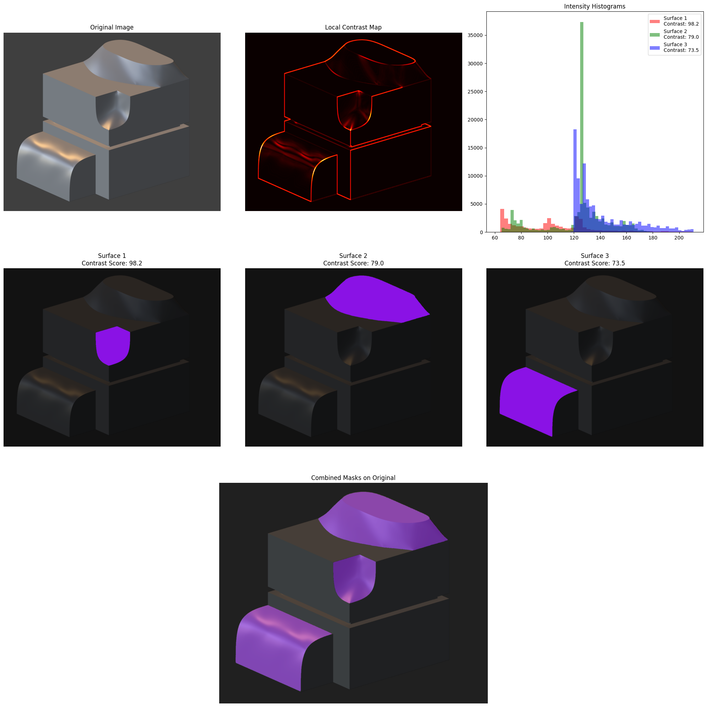

# Computer Vision Project

This repository contains solutions for interesting Computer Vision tasks. 

The full code solution located in the [jupyter notebook](notebook/computer-vision-for-atlas.ipynb).

---

## Task 1

---

## Task 2

---

## Task 3

---

## Task 4

